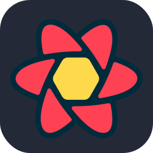
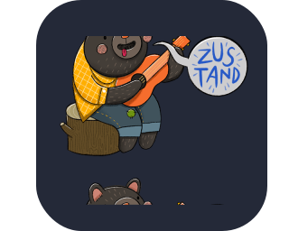
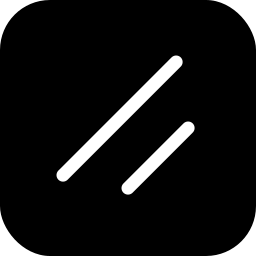

<h1>Hello! I'm Valentin Zoia  🚀</h1>
<h2>Frontend Developer 💻🎨</h2>

### About Me
- I am 19 years old and I am from Buenos Aires, Argentina.
- I am a MERN full stack developer.
- I am a self-taught and highly creative individual who seeks to learn and improve every day.
- I enjoy working with the frontend because I want to provide the best visual experience for the users who visit my projects.

<h2>⚒️ Languages-Frameworks-Tools ⚒️</h2>
 

            
               
            
             
              
              
             
             
            

 

<h2> 📨 Contact Me 📨</h2>

 
  
  
  <a href="" target="_blank">
      <!-- sqlite, safari, google-chrome are other good icon options -->
  </a>

<h2>⚡ Stats ⚡</h2>
 

  
  
  
  
  

